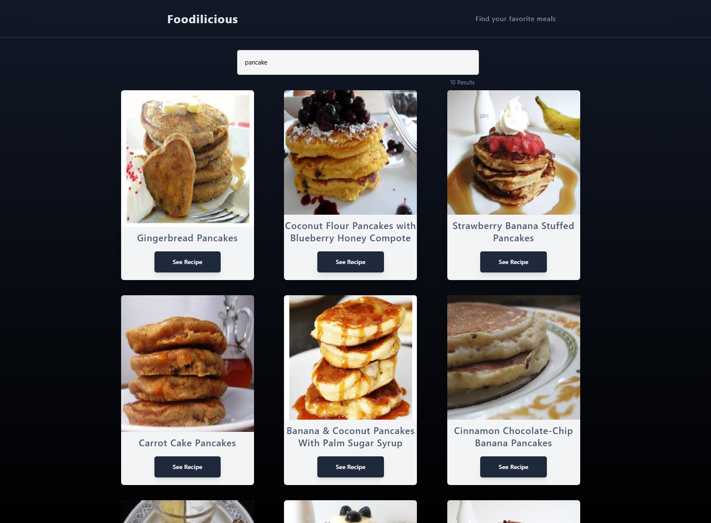

# Foodilicious 🍴

**Foodilicious** is a simple and user-friendly web application that helps you discover delicious recipes based on your search queries. Powered by the [Spoonacular API](https://spoonacular.com/food-api), Foodilicious provides a seamless way to explore new dishes and find inspiration for your next meal.

---

## Features ✨

- 🔍 **Search Recipes**: Enter any ingredient or dish name to find a wide variety of recipes.  
- 📖 **Detailed Recipe Information**: Get insights into recipe preparation time, ingredients, and more.  
- 🌐 **API Integration**: Leverages the robust Spoonacular API to fetch recipe data dynamically.  
- 🎨 **Responsive Design**: Optimized for use on any device, whether desktop or mobile.  

---

## Screenshot 📸

Below is a preview of the Foodilicious web app interface:  



---

## Getting Started 🚀

### Prerequisites
- Node.js and npm installed on your system.

### Installation
1. Clone the repository:
   ```bash
   git clone https://github.com/jas-singhh/recipes-finder.git
   ```
2. Navigate to the project directory:
   ```bash
   cd recipes-finder
   ```
3. Install dependencies:
   ```bash
   npm install
   ```

### Running the App
1. Start the development server:
   ```bash
   npm run dev
   ```
2. Open your browser and go to:
   ```
   http://localhost:3000
   ```

---

## API Integration 🛠️

Foodilicious utilizes the **Spoonacular API** for fetching recipe data. To use the app, ensure you have an API key from Spoonacular.  
Update the `.env` file with your API key:
```env
NEXT_PUBLIC_SPOONACULAR_API_KEY=your_api_key_here
```

---

## License 📜

This project is licensed under the [MIT License](LICENSE).

---

Happy cooking! 👨‍🍳👩‍🍳
